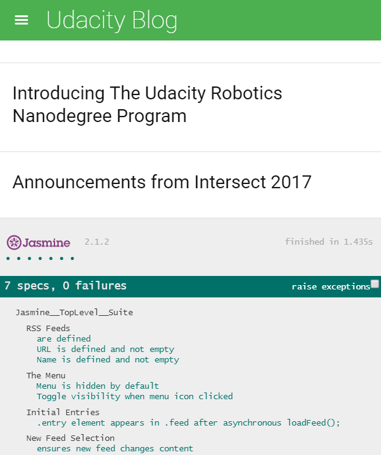

## Overview

This is the final project in Udacity's Front End Web Developer Nanodegree. The purpose is to learn the standard of development known as "test-driven development".
You are given a web-based application that reads RSS feeds. I used [Jasmine 2.2.0](https://jasmine.github.io/2.2/introduction) to write a number of tests against the
business logic of the pre-existing application as well as the event handling and DOM manipulation.

Project was evaluated by a Udacity reviewer according to this [rubric](https://review.udacity.com/#!/rubrics/18/view)

## Getting Started

- clone this repository or download the ZIP
- Select the index.html file to start the application.

## Sources

 - Check out the required project assets & overall requirements of the project provided by [Udacity](https://github.com/udacity/frontend-nanodegree-feedreader)

## References

- [Jasmine 2.2.0](https://jasmine.github.io/2.2/introduction)
- [Jasmine asynchronous support](https://jasmine.github.io/2.0/introduction.html#section-Asynchronous_Support)
- [Learn Handlebars.js in 10 minutes](http://tutorialzine.com/2015/01/learn-handlebars-in-10-minutes/)
